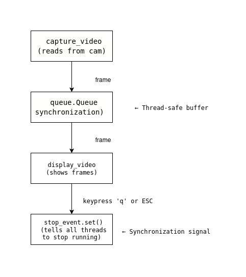

# Multithreaded Video Capture in Python

This project demonstrates **multithreading, synchronization, and video streaming** in Python using OpenCV.

---

## Why This Project Matters

This example was designed as a **technical test task** to demonstrate:
- Use of **threads** in Python (`threading.Thread`)
- Safe **data synchronization** between threads (`queue.Queue`)
- Coordinated **shutdown mechanism** (`threading.Event`)
- Handling **real-time video stream** with OpenCV
---

## Requirements

- Python 3.7+
- OpenCV (`pip install opencv-python`)

---

## Usage

```bash
python multithreaded_video_capture.py
```

- Press **`q`** or **`ESC`** to stop the program.

---

## Execution Flow
 
---

## Synchronization Mechanisms

- **`queue.Queue`**  
  Thread-safe way to pass frames from the capture thread to the display thread.  
  Prevents race conditions.  
  Uses `put()` and `get()` with timeout to avoid blocking.  

- **`threading.Event` (`stop_event`)**  
  Global stop signal.  
  Both threads periodically check `stop_event.is_set()`.  
  Pressing **`q` or `ESC`** sets the event → all threads stop gracefully.  

---

## Workflow

1. **`capture_video`** reads frames from the camera.  
2. Frames are placed in a **queue** (if full → old frames are dropped).  
3. **`display_video`** reads frames from the queue and displays them.  
4. User presses **`q` or ESC** → `stop_event.set()` is called.  
5. Both threads exit cleanly.  
6. Camera and OpenCV resources are released.  

---
